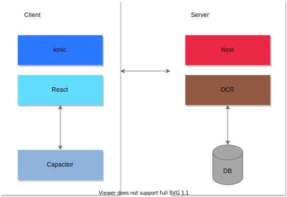
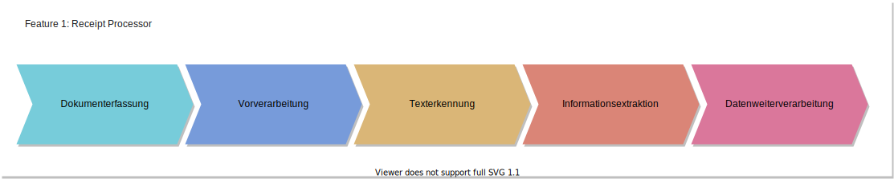
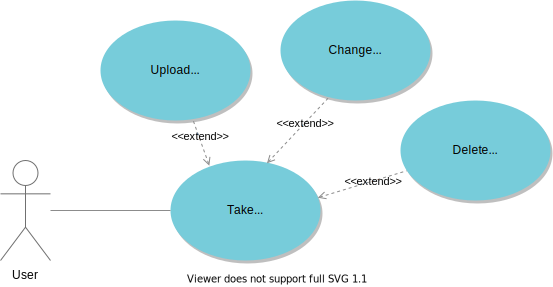
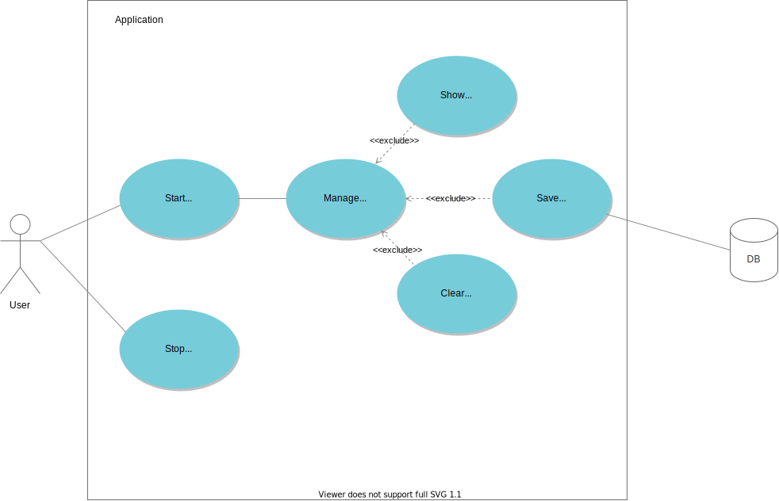

# Receipt Processor

Als **Receipt Processor (kurz RP)** wird das erste Feature der Applikation **feedMe** bezeichnet, das den grundlegenden Prozess der Extraktion von relevanten Informationen umfasst, die auf einem Kassenbeleg (Kassenbon) eines Lebensmittelgeschäfts aufgelistet sind und mithilfe gängiger Methoden von **OCR (Optical Character Recognition)** verarbeitet werden.

Als OCR wird ganz allgemein der Prozess der Erkennung, Digitalisierung und Aufteilung eines Dokuments, oder auch Bildes mit textlichem Inhalt, 


Der RP ist ein grundlegender Schritt zur Vereinfachung der Aufzeichnung und Verfolgung, sprich der Verwaltung von Lebensmitteln, welche die smarte Digitalisierung eines Kassenbelegs ermöglicht, um foglich den Prozess der manuellen Eingabe bereits erworbener Produkte zu automatisieren. 


<br/>

#### <ins>Grundlegende Idee & allgemeiner Überblick:</ins>

Als **Receipt Processor** wird das erste Feature (Feature 1) der Applikation **feedMe** bezeichnet, das den grundlegenden Prozess der Extraktion von relevanten Informationen, die auf dem Kassenbeleg (Kassabon) eines Lebensmittelgeschäfts aufgelistet werden, mithilfe der Methoden von **OCR (Optical Character Recognition)** umfasst. Das Feature soll dabei den allgemeinen Ablauf der Aufzeichnung und Verfolgung, sprich die Verwaltung von Lebensmitteln vereinfachen, sowie die smarte Digitalisierung des Kassenbelegs ermöglichen, um folglich den Prozess der manuellen Eingabe bereits erworbener Produkte zu automatisieren.

Als *Optical Character Recognition (OCR)* wird allgemein der Prozess der Erkennung, Digitalisierung und Aufteilung eines Dokuments als auch Bildes mit textlichen Inhalt, in dessen einzelne Bestandteile (Wörter, Buchsteben, Zeichen, etc.) bezeichnet, um die maschineller Verarbeitung von Informationen zu ermöglichen, zu vereinfachen und effizienter zu gestalten.

Im Gegensatz zum Menschen sind Computer aufgrund des mangelnden Wissens und Erfahrungswerts kaum in der Lage, spezifische und kontextbezogene Informationen lediglich durch das Betrachtend des jeweiligen Gegenstands, intuitiv und vollständig zu erfassen. Trotz einer jahrzehntelangen, intensiven Forschung bleibt die Umsetzung eines OCR-Systems mit vergleichbaren Fähigkeiten noch unerreicht. Aufgrund der großen Vielfalt an Sprachen, der unterschiedlichen Schriftarten und -Stile, als auch der komplexen Regeln in der Grammatik, wird der Prozess der Extraktion relevanter Informationen eines Dokuments, bzw. Bildes auch in Zukunf eine große Herausforderung darstellen.

<br/>

#### <ins>Architektur:</ins>

Der Ordner *receipt-processor* beinhaltet den gesamten Sourcecode, sowie die Dokumentation und Diagramme, die zur Veranschaulichung der einzelnen
Kernfunktionalitäten der Applikation dienen. Als *client* wird die Anwendung selbst bezeichnet, mit welcher der Benutzer direkt interagieren kann und in *React*
implementiert ist. Um entsprechend robuste User Interfaces bereitzustellen, die einem nativen Aussehen und Verhalten nahe kommen, sowie sich individuell gestalten
lassen, wurde das Framework *Ionic* integriert. Dadurch wird der Fokus entsprechend auf die Entwicklung einer progressiven Webapplikation gelegt, die sich unabhängig von der Plattform des jeweiligen Endgeräts ausführen lässt und native Funktionalitäten, wie z.B. Kamera, Push Notifications, etc. zur Verfügung stellt.

Entsprechend ist die Anwendung nach dem Prinzip der *Client-Server-Architektur* aufgebaut:

<br/>

<div align="center">
  
</div>

<br/>
<br/>

#### <ins>Anwendung & allgemeiner Ablauf:</ins>

Mithilfe der Kamerafunktionalität des jeweiligen Endgeräts (z.B. Smartphone, Tablet, Laptop, etc.) soll ein Foto von dem gewünschten Kassenbeleg gemacht werden, das anschließend im lokalen Speicher (Local Storage) des Browser persistiert wird. Dabei ist der Benutzer in der Lage das Bild vorzuverarbeiten, sprich unterschiedliche Methoden der Bildvorverarbeitung anzuwenden, um folglich den Prozess der Texterkennung zu beeinflussen und die Relevanz der Ergebnisse entsprechend zu erhöhen. Nach der Texterkennung können verschiedene Verfahren der Informationsextraktion angewendet werden, um diese für die Weiterverarbeitung entsprechend aufzubereiten.

<br/>


<br/>

Das Feature 1 lässt sich entsprechend in die Unterprozesse *Dokumenterfassung*, *Vorverarbeitung*, *Texterkennung*, *Informationsextraktion* und *Datenweiterverarbeitung* unterteilen:

<div align="center">
  
</div>

<br/>
<br/>

### **Dokumenterfassung**

#### <ins>Allgemeine Funktionalitäten:</ins>

Wie bereits zuvor erwähnt soll der Benutzer in der Lage sein, mithilfe der Kamera des jeweiligen Endgeräts, ein Bild von dem gewünschten Kassenbeleg zu machen und diesen für die Weiterverarbeitung zu persistieren. Das Bild kann dabei jederzeit geändert oder gelöscht werden. Für das Erfassen des Kassenbelegs wird das Plugin *Camera* von *Capacitor* verwendet:

https://capacitorjs.com/docs/apis/camera

<br/>

<div align="center">
  
</div>

<br/>

#### <ins>Anwendung & Codebeispiele:</ins>

<br/>

```bash
$ npm install @capacitor/camera
```

<br/>

```TSX
import { 
  Camera, 
  CameraResultType 
} from '@capacitor/camera';

const takePicture = async () => {
  const image = await Camera.getPhoto({
    quality: 100,
    allowEditing: true,
    resultType: CameraResultType.Uri
  });
};
```

<br/>

Nachdem das Foto gemacht oder hochgeladen wurde, wird dieses im *Redux-Store* als Base64 gespeichert. Das Redux-Feature *receiptSlice* wird im lokalen Storage des Browsers mit dem Schlüssel *receipt* gespeichert, um entsprechend nach dem Refresh für die Weiterverarbeitung zur Verfügung zu stehen:

```TSX
import {
  useDispatch
} from 'react-redux';

import {
  setReceipt
} from 'src/redux/features/receiptSlice';

const takePicture = async () => {
  try {
    const image = await Camera.getPhoto({
      quality: 100,
      resultType: CameraResultType.DataUrl,
      source: CameraSource.Camera
    });
    
    if(image.dataUrl) {
      dispatch(setReceipt(image));
    }
  } catch(error) {
      console.log(error);
  }
};
```

<br/>

Der Kassenbeleg wird anschließend in der Komponente *PreviewContainer* angezeigt. Ist kein Kassabon vorhanden, wird dem Benutzer eine Illustration angezeigt und die Funktionalität der Analyse entsprechend verhindert. Nach dem Hinzufügen stehen die Methoden *Pre-Processing* und *Delete Photo* der Komponente *ReceiptOptionFab* zur Verfügung, welche als Fab-Button mit den verschiedenen Auswahlmöglichkeiten, am rechten unteren Rand der jeweiligen Komponente dargestellt werden:
<br />


#### <ins>Herausforderung & Lösungsansatz</ins>

<br/>

Die Qualität des Bildes, sowie der Zustand des Kassenbelegs sind entscheidend für die Genauigkeit der Analyse.

<br/>

### **Texterkennung - Optical Character Recognition (OCR)**

<br/>

Wie bereits zuvor erwähnt, wird als *Optical Character Recognition (OCR)* ganz allgemein der Prozess der Erkennung, Digitalisierung und Aufteilung eines Dokuments als auch Bildes mit textlichen Inhalt, in dessen einzelne Bestandteile (Wörter, Buchstaben, Zeichen, etc.) bezeichnet, um die maschinelle Verarbeitung von Informationen zu ermöglichen, zu vereinfachen und effizienter zu gestalten. 

<div align="center">
  
</div>

<br/>

Dabei soll der Benutzer in der Lage sein.... //TODO


#### Tesseract.js

*Tesseract.js* ist eine frei verfügbare (Open-Source) JavaScript-Bibliothek, welche die original in C geschriebene Bibliothek *Tesseract* kompiliert und mithilfe von *WebAssembly* für den Browser ausführbar macht. Die Texterkennung erfolgt dabei anhand eines *neuronalen Netzwerks*, das wiederum auf dem Prinzip *LSTM (Long Short-Term Memory)* basiert, um entsprechend möglichst akkurate Ergebnisse beim Erkennenungsprozess zu erzielen.

```bash
$ npm install tesseract.ts
```

```JSX

```

<br/>


```JSX

```

<br/>


#### Result-Objekt

Die folgende Abbildung veranschaulicht das Objekt mit den entsprechenden Attributen, welches nach dem Erkennungsprozess von Tesseract zurückgegeben wird:

//TODO: Image Result-Objekt

<br/>

Das Objekt ist allerdings äußerst komplex aufgebaut und weist zirkulare Abhängigen und Strukturen auf. Folglich muss das Objekt vor der Weiterverarbeitung  vereinfacht werden, um dieses entsprechend im Redux-Store sowie lokalen Speicher persistieren zu können. 

```bash
{
  metaInfo: {
    confidence: 80,
    lines: 42,
    word: 192
  },
  lines: [
    {
      id: 0,
      confidence: 
    }
  ]
}
```

<br />

### **Informationsextraktion**

//TODO:

### **Kassenbeleg (Kassabon) - Untersuchungsgegenstand**

Die Kassenbelege der gängigen Lebensmittelgeschäfte in Tirol:

- MPreis
- Hofer
- Spar
- Billa Plus
